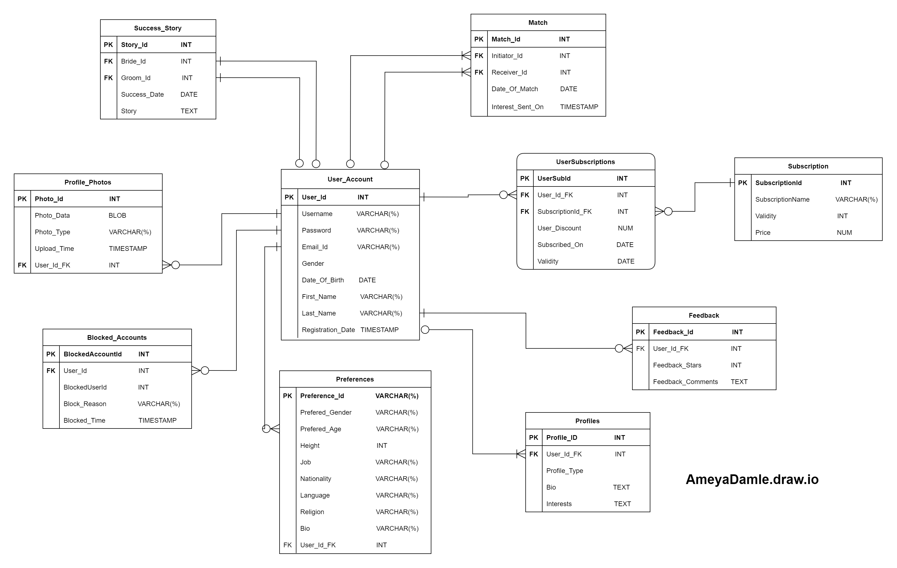

# Data Modeling Dating-Platform 
This repository contains a data project builded for a fictitious dating platform aimed to creating and modeling a database. 

## 1. Conceptual Model

#### Understanding business requirements

```
In today's digital age, individuals are increasingly turning to online dating platforms to connect with potential partners and build meaningful relationships. As a result, there's a growing demand for robust and efficient database systems to power these platforms and facilitate seamless user interactions.

Our task is to design a comprehensive database schema for a dating platform that caters to the diverse needs of users while ensuring scalability, security, and data integrity. The database should support various features such as user profiles, matches, blocking functionality, preferences, feedback and more.

Deliverables:

Entity-Relationship Diagram (ERD): Develop a comprehensive ERD outlining the relationships between entities such as users, profiles, matches, messages, and more.

Database Schema: Define the database schema with appropriate tables, columns, and constraints to represent the data model accurately.

SQL Scripts: Create SQL scripts to create and populate the database tables, define indexes, and implement stored procedures or triggers as needed.

Documentation: Prepare documentation detailing the database design, including data dictionary, schema diagrams, and implementation guidelines for developers.

Overall, the goal is to design a database that serves as the foundation for a successful and user-centric dating platform, providing a seamless experience for users while ensuring data privacy, security, and scalability.
```

#### Visual representation
<p align="center">  </p>
This image was made using software:

[draw.io](https://app.diagrams.net/)

## 2. Physical Model
```
/* DatingPlatform-Model-Logic: */

CREATE TABLE User_Account(
    User_Id INT PRIMARY KEY AUTO_INCREMENT,
    Username VARCHAR(100) NOT NULL UNIQUE,
    Password VARCHAR(200) NOT NULL,
    Email_Id VARCHAR(100) NOT NULL UNIQUE,
    Gender ENUM('Male', 'Female', 'Other') NOT NULL,
    Date_Of_Birth DATE,
    First_Name VARCHAR(100) NOT NULL,
    Last_Name VARCHAR(100),
    Registration_Date TIMESTAMP DEFAULT CURRENT_TIMESTAMP
);

CREATE TABLE Profiles(
    Profile_ID INT PRIMARY KEY AUTO_INCREMENT,
    User_Id_FK INT,
    Profile_Type ENUM('Dating', 'Friendship', 'Work') NOT NULL,
    Bio TEXT,
    Interests TEXT,
    FOREGIN KEY (User_Id_FK) REFERENCES User_Account(User_Id) ON DELETE CASCADE ON UPDATE CASCADE
);

CREATE TABLE Preferences(
    Preference_Id VARCHAR(100) NOT NULL,
    Prefered_Gender VARCHAR(100),
    Prefered_Age VARCHAR(100),
    Height INT,
    Job VARCHAR(100),
    Nationality VARCHAR(100),
    Language VARCHAR(100),
    Religion VARCHAR(100),
    Bio VARCHAR(250),
    User_Id_FK INT,
    FOREGIN KEY (User_Id_FK) REFERENCES User_Account(User_Id) ON DELETE CASCADE ON UPDATE CASCADE
);

CREATE TABLE Profile_Photos(
    Photo_Id INT PRIMARY KEY AUTO_INCREMENT,
    Photo_Data BLOB NOT NULL,
    Photo_Type VARCHAR(100),
    Upload_Time TIMESTAMP DEFAULT CURRENT_TIMESTAMP NOT NULL,
    User_Id_FK INT,
    FOREGIN KEY (User_Id_FK) REFERENCES User_Account(User_Id) ON DELETE CASCADE ON UPDATE CASCADE
);

CREATE TABLE Blocked_Accounts(
    BlockedAccountId INT PRIMARY KEY AUTO_INCREMENT,
    User_Id INT,
    BlockedUserId INT,
    Block_Reason VARCHAR(250),
    Blocked_Time TIMESTAMP DEFAULT CURRENT_TIMESTAMP NOT NULL,
    FOREIGN KEY (User_Id) REFERENCES User_Account(User_Id) ON DELETE CASCADE ON UPDATE CASCADE,
    FOREIGN KEY (BlockedUserId) REFERENCES User_Account(User_Id) ON DELETE CASCADE ON UPDATE CASCADE
);

CREATE TABLE Success_Story(
    Story_Id INT PRIMARY KEY AUTOINCREMENT,
    Bride_Id INT NOT NULL,
    Groom_Id INT NOT NULL,
    Success_Date DATE NOT NULL,
    Story TEXT NOT NULL,
    FOREIGN KEY (Bride_Id) REFERENCES User_Account(User_Id) ON DELETE CASCADE ON UPDATE CASCADE,
    FOREIGN KEY (Groom_Id) REFERENCES User_Account(User_Id) ON DELETE CASCADE ON UPDATE CASCADE
);

CREATE TABLE Match(
    Match_Id INT AUTO_INCREMENT PRIMARY KEY,
    Initiator_Id INT NOT NULL,
    Receiver_Id INT NOT NULL,
    Date_Of_Match DATE NOT NULL,
    Interest_Sent_On TIMESTAMP DEFAULT CURRENT_TIMESTAMP NOT NULL,
    FOREIGN KEY (Initiator_Id) REFERENCES User_Account(User_Id) ON DELETE CASCADE ON UPDATE CASCADE,
    FOREIGN KEY (Receiver_Id) REFERENCES User_Account(User_Id) ON DELETE CASCADE ON UPDATE CASCADE
);


CREATE TABLE Feedback(
    Feedback_Id INTEGER PRIMARY KEY AUTO_INCREMENT NOT NULL,
    User_Id_FK INT NOT NULL,
    Feedback_Stars INT,
    Feedback_Comments TEXT NOT NULL,
    FOREIGN KEY (User_Id_FK) REFERENCES User_Account(User_Id) ON DELETE CASCADE ON UPDATE CASCADE
);

CREATE TABLE Subscription(
    SubscriptionId INT,
    SubscriptionName VARCHAR(100) NOT NULL,
    Validity INT NOT NULL,
    Price NUMERIC(19,2) NOT NULL,
);

CREATE TABLE UserSubscriptions(
    UserSubId INT NOT NULL PRIMARY KEY AUTO_INCREMENT,
    User_Id_FK INT,
    SubscriptionId_FK INT,
    User_Discount NUMERIC(19,2),
    Subscribed_On DATE NOT NULL,
    Validity Date NOT NULL,
    FOREIGN KEY (User_Id_FK) REFERENCES User_Account(User_Id_FK) ON UPDATE CASCADE,
    FOREIGN KEY (SubscriptionId_FK) REFERENCES Subscription(SubscriptionId) ON UPDATE CASCADE
 );
```